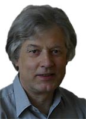

## The author

Šrajer Jiri was born in Opava in the Czech Republic in 1950.
He graduated mathematics at the Charles University in Prague.
For over 30 years working as a computer specialist at various companies (as a programmer, analyst, or administrator).
Since 1988 he has lived permanently in Poland. 
Co-founder and president of the Association of Programmers and NotProgrammers SPIN in Biskupiec,
which dealt with the use of artificial intelligence in games and organized tournaments logic of computer programs.
While writing the book PROBABLY EVERYTHING IS DIFFERENT about AI
he realized that our idea of the geometry of the universe is probably wrong
and he has begun intensive work on a new space-time model.
