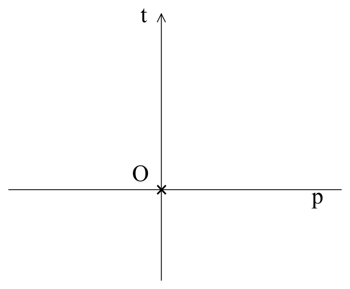
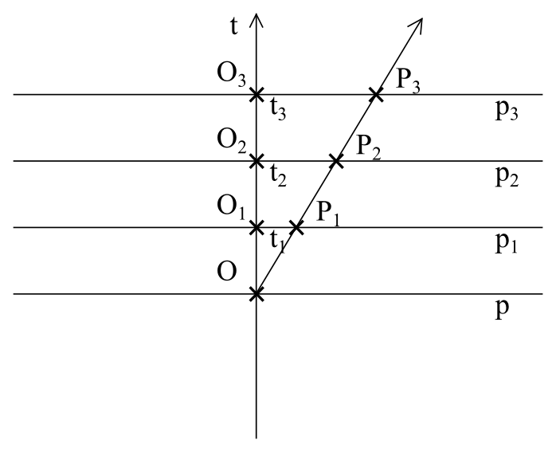

## X. The principle of relativity in space-time

At the beginning the analysis should be performed by adopting the simplest model. Therefore, our analysis we will commence from a one-dimensional space which we can imagine as the straight line **p** in which the static observer **O**is placed. When we add time as the orthogonal straight line **t** to the space **p**, we will receive a two-dimensional space-time (Fig. 8).

Figure 8

We assume that our observer does not move in space (being more precise: someone does not move towards the system of coordinates he/she is correlated to), that is, in space-time he/she will move only towards the axis **t**
and further towards **t1**, **t2**, **t3** he/she will be in points
**t1**, **t2**, **t3** at the axis **t** (Fig. 9).

Figure 9

To our model we will add one more observer **P**, who will drift away from the observer **O** in a uniform linear motion. Its track in space-time will be tilted towards the time axis of the observer **O** under certain angle, depending on the speed of the observer **P** drifts away from the observer **O** (figure 10).	

Figure 10

The principle of relativity, however, says that the motion is relative. When we have got two observers who drift away from each other it is difficult to determine which one is at rest and which one is in motion. In other words, the observer **P** may state that someone does not move in space and the observer **O** drifts away from him/her. For him/her the time flows in his/her direction in space-time, that is, along the line **u** and space passes in the direction of the line **r** (Fig. 11).

Figure 11

When we follow the principles of relativity then the point of view of the observer **O** and the observer **P** must be analogical.

In view of the fact that we can repeat the entire operation starting from the observer **P** and the speed of drifting away of the other observer can  be changed, it seems that in our space-time, space and time can pass in any direction. Because the light for each observer must pass the same, that is, it spreads out with the same speed in all directions in space-time and for the light time does not exist.

However, a few problems appear at once. For example, what the speed of light exactly is when for the light time does not flow and the entire space-time for it is the only space. The more serious problem is related to causation. When the direction of time in space-time can be arbitrary, then for two different observers it can flow in opposite directions. Then, it would violate causation. At this point, in our analysis we must stop and think where are we wrong and which of the assumptions must be changed.

Actually, finding a solution is often difficult because some assumptions we make subconsciously. We have been thought and used to some approaches, and we do not consider them as assumptions. Therefore, it is not easy to find out that the problem of causation can be a result of our writing and drawing on a flat sheet of paper and therefore our model is flat. If it is not flat, what is it then? The very first idea is that we will start to bend the plane and we will create the surface of a sphere from it. But the sphere does not only give us the solution to the problem but it also creates another one, ie. what happens when the observer moves around in time the entire sphere and he/she returns to the place he/she started from? All such problems disappear when the sphere starts to expand. Then, we will have a different perception of time. Time has got two dimensions here. The local time, different for different observers, which depending on the speed, takes different direction in space-time. On the other hand, the cosmic time in the direction of expanding the space-time, which in certain point is identical to all observers and it concerns also the light. In such model the principle of causation is not violated because although the local time of the two observers flows in an opposite direction, the cosmic time ensures that the sequence of events is provided.

## [XI. Complex time and the space-time interval](rozdzial11) 
