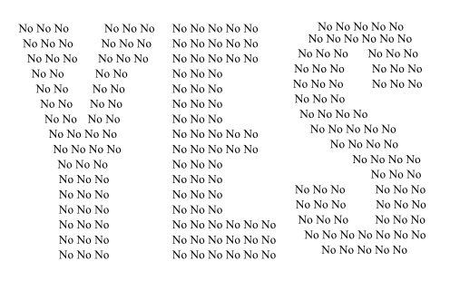

## XIII. Conclusion

The reality is always more interesting than any other model. As to reflect the reality in most effective way, models become increasingly expanded. In this way the adopted mathematical modelling is complicated to such an extend that apart from experts in the respective field nobody really understands it. However, understanding a model does not necessarily mean understanding the reality. For example, equations do not explain how we should interpret the results.

An example of a non-classic interpretation of results is the story described by Marcel Granet in his book  "La pensée chinoise" (Chinese thinking). He writes about a legend in which generals before the battle did not know what to do, whether to attack or to withdraw. Unable to make any decision they agreed to vote. It became clear that three of them wanted to attack and eight of them wanted to withdraw. It would seem that the result should be interpreted that they decided to withdraw. Yet as a result of such voting the generals decided to attack because they interpreted the number „three” as the number that expresses unanimity. They attacked and won.
...
<!--The fact that we compute something does not mean that we know how to interpret it. The reality is not only black and white and unequivocal. When making any decision we follow a simplified pattern, even a simple one, and details are the decisive factor what we find important at the respective moment. For example, in the light of the following diagram, can we decide whether **YES** czy **NO**?

Despite other factors it is important at what distance we look at any given phenomenon.

In the case of short distances, we may think that the light passes with an infinite speed and everything is the way we see it. At such assumption we may believe that we see a three-dimensional space around us.

When we observe areas at such a distance that the light comes to us with a noticeable delay, then we do not see space but different parts of space-time. In this way, the interpretation what we see is not a result of computations, but is an outcome of our way of thinking.

## [Literature](literatura) -->
