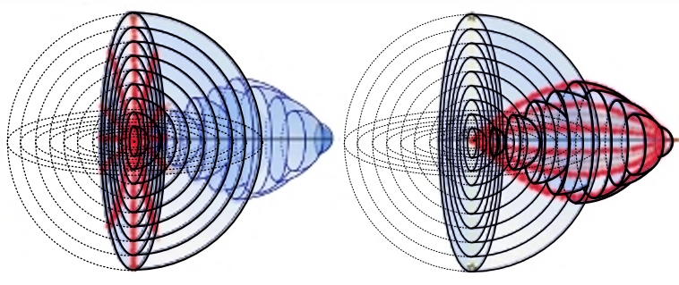

## II. The observable Universe

*The fact that we have any information about Cosmos at all it is because Cosmos is full of various waves. The picture of the Universe we imagine only on the basis of waves which reach us and the waves we can record. Supported by experience concerning short distances we believe that the observed objects are in the direction from which the emitted light reaches us and the distance equals to the light path from the object to us. However, it does not also have to be true...*

My analysis of the geometry of the Universe has commenced from the following remarks:

In view of the limited speed of light we do not see the objects in the sky the way they truly are at the moment of observation but only the way they appeared some time ago. For example, we see the Sun the way it looked about 8 minutes ago, the closest stars the way they looked few years ago and distant galaxies billions years ago. The most distant objects are the oldest ones. One may imagine that they are placed in a giant sphere of the radius of few million of light-years.

Nevertheless, provided the universe was small at the beginning then the oldest sphere cannot be big. It is not especially important whether in such fictitious sphere there are concrete objects or not, even the fact whether there was any light that time. Assuming that at the beginning the Universe was in one point, for us such point is the furthest point located from all. And the thing that is at the furthest distance from us we consider as a huge sphere...

How can we explain that something small seems to be so big to us? At first, it seems to be an absurd. How the entire Universe can be inside a small sphere or even located at one point?  

*Before going any further, we need to perform the following imaginary experiment. Let us imagine that at the Earth’s surface lights are deployed and every light is connected to an optical fibre along meridians. We are sitting in a round room on the North Pole and around us there are screens on which we can observe all the lights. Looking out the window we see straight optical fibres and we imagine that every light is in the form of a straight line going in the direction the optical fibre is connected. We can also determine the length of every optical fibre (e.g. by sending through the optical fibre a light signal and wait for its reflection). Such length is perceived to be the length of the light in the straight line from us. The points at the same distances from us will be positioned in latitude circles.*

*If we are certain that all lights are placed at the same plane, then on a sheet of paper we can draw an adequate map. The circles of increasingly bigger radius will correspond to the respective circles of lattitude which are increasingly distant from us. When we cross the equator, the circumferential length of the latitude circles will be shorter but the radii of the circles on our map will be still growing. The furthest point which we can see is the South Pole. It can be seen from every direction in which we look and for us it will be as a huge circle which covers all other points...*

Let us return to the problem how we can imagine the deployment of objects in space-time and determine the light path in the expanding Universe. My reasoning was the following:

The entire observable Universe we can imagine as built from spheres around us with an increasingly growing radius. The bigger radius, the older the sphere is (Fig.1).

Figure 1.

When we add time as another dimension and we place each sphere in the corresponding time then the spheres will build a four-dimensional cone (Fig.2).

Figure 2.

*If there is anyone who has difficulties with imagining a four-dimensional cone, someone can remove one dimension and imagine only a cross-section through the observable Universe. Instead of spheres which are cut through in his/her imagination by using a plane, then he/she will receive a system of concentric circles in the plane. When adding time as a further dimension, in this way, a simple cone can be created.*

When the Universe expands then at going back in time it must shrink. The oldest spheres must by small (Fig.3). 

                       

Figure 3.

The objects we perceive as distant, in space-time may be close to each other (Fig.4).

Figure 4.

When we imagine the observable Universe, as respectively smaller and deployed in space-time spheres, then few more cosmological problems will be solved at once. Homogeneity of the background radiation ceased to be a problem when we realise that the background radiation although it reaches us from every direction and very long distances, it comes from a small area of space-time (Fig.5).

Figure 5.

Considering the above, it has been proven that in the observable Universe there are not any causatively disjunct areas, because the more distant the objects are, the closer they are to each other. Cosmic inflation, that is a huge magnification of the Universe size in a fraction of a second, will become not essential, because the expansion of the oldest spheres occurs only in our imagination. We understand that when one imagines a curved area of space-time as a non-curved three-dimensional space, then in such space distant objects  are expanded similarly to the areas on the flat map of the globe. In consequence, such space apparently lacks a huge amount of matter and energy...

Does anything that has been presented so far refer to the geometry of space?

Only that under direct observations one cannot state whether the space is curved or non-curved. The object we image as a non-curved three-dimensional space is built from various spheres somehow deployed in space-time which additionally we see as expanded in a divergent way.

The assumption that time is linear and space-time can be understood as respective momentary spaces arranged next to each other along the timeline, does not have to be true. Regardless the above, the observable Universe can be seen as a system of spheres of different time parameters.

Irrespectively of the fact whether space is curved or flat what we only see from every momentary space is a sphere. It does not give any grounds for stipulating the curvature of space.

Simultaneously, what it is observed is that for obtaining a proper picture of the Universe, the deployment of objects in space-time needs to be determined. And here another problem arises. How to determine distances in space-time? For such purpose in mathematical models the space-time interval is used. When we want to employ it, in reality we will receive a zero value for all objects we see at any given moment. It appears that the space-time interval in the observable Universe is not the distance of two events in space-time but it is the distance of a light signal related to one event, from the other event.

When we want to determine the right deployment of objects in the Universe we must find the most reliable definition of distance in space-time. This task does not belong to the easy ones. As to understand the problem correctly, we need to analyse the entire way the concept of space-time was formulated, and we also need to estimate the distance in space-time. Later, we need to determine what assumptions were employed to create the space-time interval and which of the assumptions may be incorrect. Then, we have to find other possibilities. For that purpose some mathematics will be needed. I will try to do it in most easy to understand way.

## [III. Mathematics and the brain](rozdzial3)
