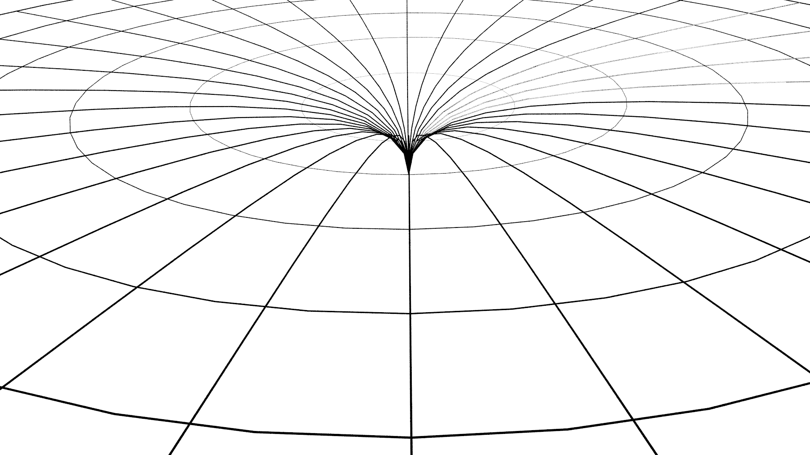

## III. Mathematics and the brain

Frequently, the same problem can be solved either by employment of mathematical equations, or geometry. For example, the gravity can be assumed as a force and it can be defined by using a mathematical equation, or it can be explained geometrically with the curvature of space-time.

*Probably, the above problem is not only concerned with employment of another tool, but also with the different hemisphere of the human brain. For example, the left hemisphere is responsible for equations and the right one deals with geometrical imagination. Therefore, for full understanding it is important not only to compute the result, but also to be able to imagine it.*

We can understand numbers as abstract symbols or we can imagine them as points on a straight line so-called   numerical axis. The point corresponding to number x  is located at a distance x from the point marked as zero (in one direction positive, in other direction negative). Provided that to one point on the straight line exactly one number is attributed, we will receive so-called real numbers.

The plane may be combined with numbers, for example, in a such manner that every point of the plane is identified with a pair of real numbers. We will receive then coordinates of every point of the plane.

(By applying the above it is easy to extend the geometry by a given number of dimensions n, provided that every point instead of a pair of numbers is defined by sequence n of real numbers x=(x1,x2,...,xn). Provided that for every pair of elements x and y we introduce the concept of its mutual distance defined by the formula

$$ d = \sqrt {(y_1-x_1)^2+ ... +(y_n-x_n)^2}  $$,

we will obtain the Euclidean space.)

Various geometrical shapes, for example, a straight line or circle are in such context a collection of the pairs of real numbers satisfying the corresponding equation. The geometrical problems can be in such manner converted into the equation solving, which from the practical point of view appears to be more convenient.

Apparently, it seems that it does not matter whether the problem is solved in a geometrical or analytical manner because the final result should be the same. However, the concern is not only regarding the result itself, but also understanding of the problem is important. If we only give the solution to an equation and we are not aware of what are we exactly estimating, then when interpreting results and adjusting them to the real conditions, further problems may arise. When the problem is formulated geometrically, it is often easier to perceive different aspects which in an equation we normally do not see.

Now, we will illustrate it by the example of gravity. According to the Newton’s theory of gravity we have the following equation 

$$ F = G * \frac{M * m}{r^2}  $$

where F is an attracting force, G - gravitational constant, M - mass of one object,  m - mass of other object, r - distance between the objects. This equation is verified in everyday life, however, it seems that for large distances it may require modifications. We do not only know what modifications and for what reason. We may act similarly to Kepler when examining the planetary motion. We might  collect a great number of data obtained from observations and then we will try to modify the equation in such a manner as to be compliant with the obtained data. Even when we succeed, we might not have the knowledge what would be the reason for it.

When we want to look at the gravitation from the geometrical point of view as the curvature of space-time, it will be more difficult to obtain precise data, but much easier to observe that the problem is related to infinity.

As there is no need to imagine an endless four-dimensional space-time, it is sufficient to limit it to two dimensions. We can imagine a two-dimensional space-time as a tensed plane in which under the weight of an object a hole is created (Fig. 6).

Figure 6

When an endless plane is considered, then the deformation can be expanded to the infinity according to the above presented description of the given equation. One can easily imagine space-time as an elastic sphere. In such case any infinity and deformation will be reduced only to one hemisphere (Fig. 7).  

Figure 7

Moreover, we immediately see that in this case equations require modifications, and we see straightforward how to do it. Simultaneously, we can realise that in Newton’s equations (and not only in Newton’s equations but in almost all equations) there is a "hidden" assumption of the existence of infinity.  

The problem of infinity is to some extent the essential one.  Provided that the Universe is finite, it must be curved. 

As shown earlier through observations any curvature of space cannot be detected. It results from the fact that we actually see only the light which is in zero distance from us. The picture of a non-curved three-dimensional space is only on our minds. We do not have the possibility of moving for longer distances and conducting measurements of distances or angles between different galaxies, which, in addition, are constantly in motion. Therefore from one place in space such curvature cannot be measured.

Now we see that computations can also be misleading. Equations may prove a non-curved space because we employ mathematics in which the numerical axis is infinite. When at the beginning we assume that  an empty space is described via equations, which somehow assume its infinity, not surprisingly, later we will receive the result indicating space as infinite.

On the other hand, the fact that the space is finite, enforces a few logical arguments. Firstly, any infinity in the real world cannot be proven – neither through observations nor experiments. Secondly, a finite space cannot be converted into an infinite space in finite time. Provided space was to be infinite it had to be endless already at the beginning. However, it seems that time and space are co-related in space-time in the manner that one observer considers it as time, whilst the other considers it as space and vice versa. In such case the Universe does not seem to exist only for the finite time, and space would be infinite.

The finite Universe gives such opportunity to investigate the phenomena, the modern cosmology cannot explain. For example, the existence of black holes in the very young Universe. When we assume that the Universe has got a shape of a sphere, then the distances between the observed objects, or distances between the objects and the observer might be different than those we think. In a non-curved space the intensity of the light decreases with the square of the distance. However, on the surface of a sphere a wave of light firstly becomes weaker but after reaching the second hemisphere it becomes stronger again. It may also spreads on the surface of a sphere few times forwards and backwards. The distance and age of the visible objects may be in this case completely different if we assume that space is non-curved.

At this stage we do not have any evidence that space is finite. However, what has been proven is that the above matter should be examined more thoroughly. When we assume the possibility that space is finite, in this case this space cannot be the Euclidean one.  In view of the above, non-Euclidean geometries should be also presented.

## [IV. Non-Euclidean geometries and determination of distances](rozdzial4)
