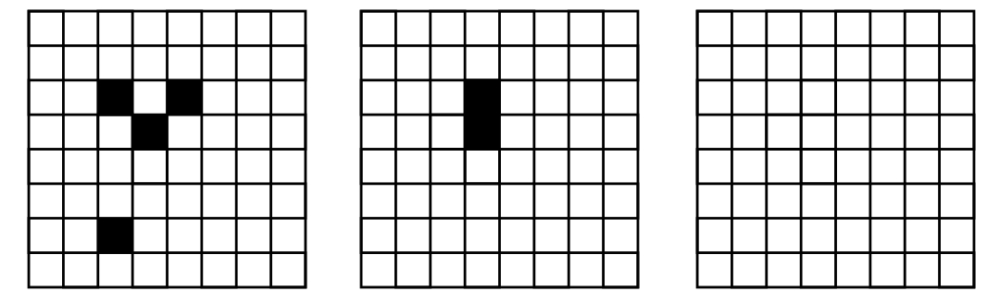
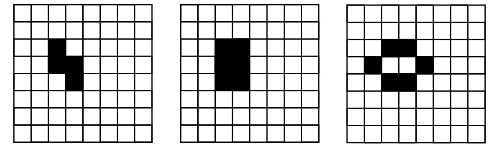
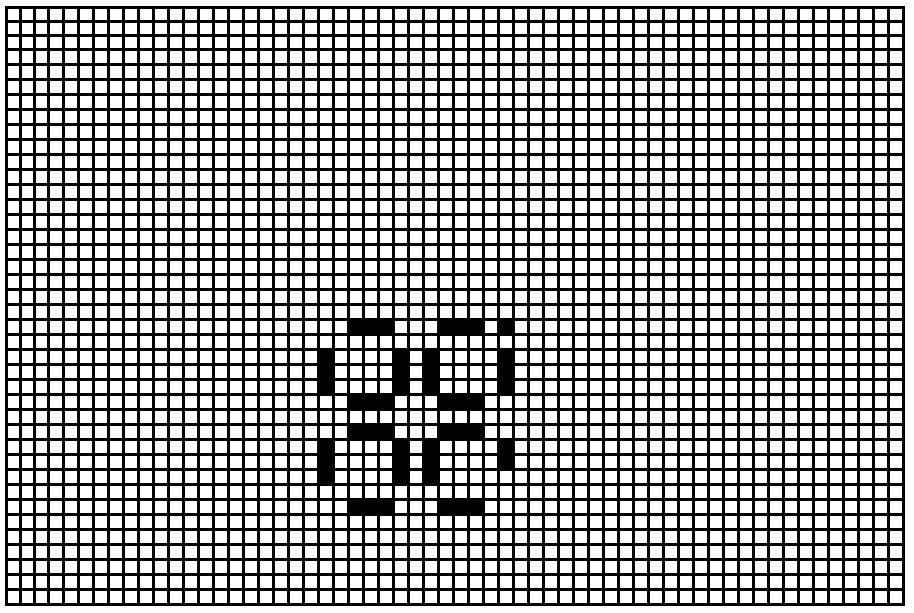
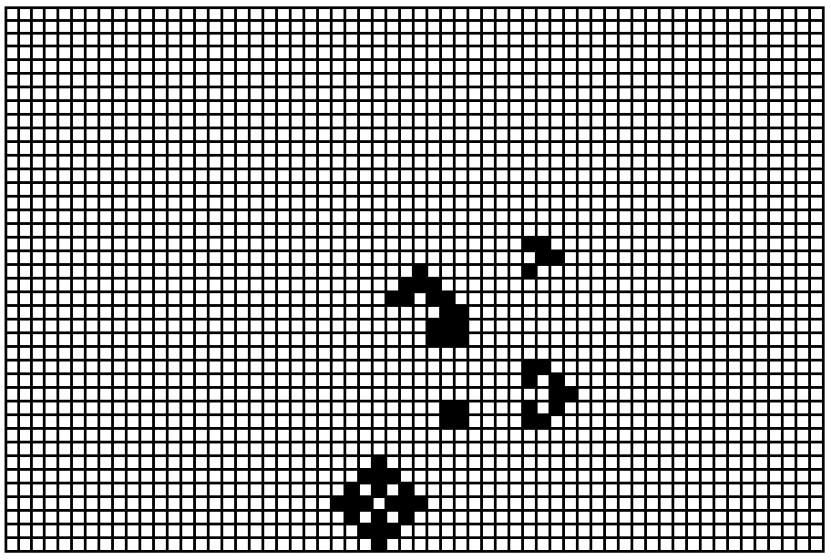
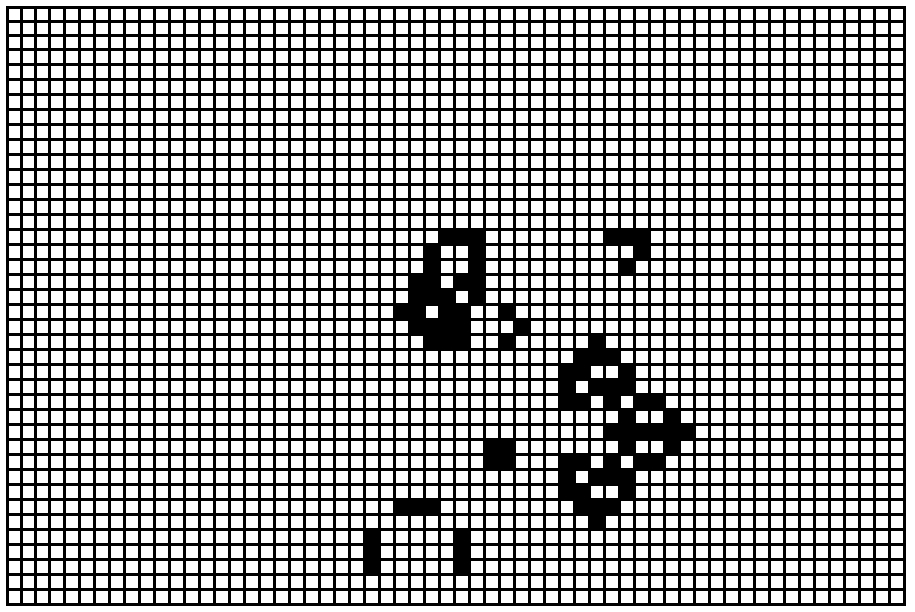
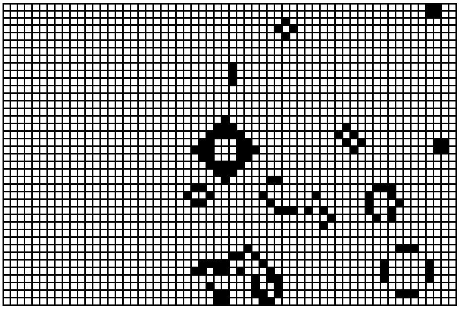
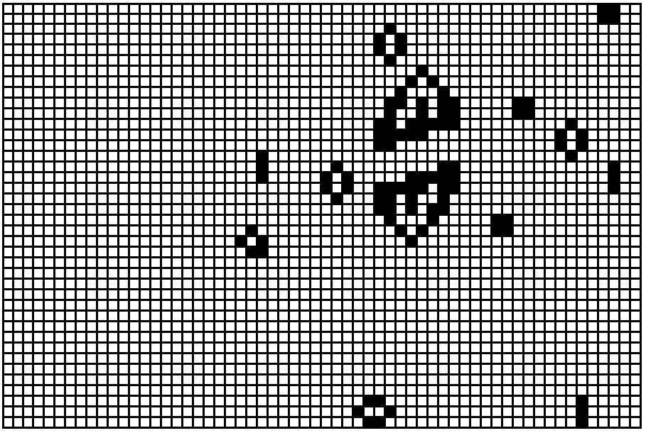

## Cellular automata
Cellular automata show how simple rules can generate complex behavior.

We will show some examples of "Game of Life".
The rules are such that the two-dimensional grid cells can have two states - be dead or alive. Living cell in the next step is still alive, if it is next to each other 2 or 3 live cells, with a different number of neighbors die. Still a cell come to life in the next step if it is next to each other exactly 3 live neighbors. In the drawings selected living cell is black and the white cell dead.

Example 1. A simple example of evolution aimed at a state in which cells no longer a state does not change:

1a) The structures of living cells gradually disappear until the blank field:

1b)  Reach to the structure, which is not changing:

Example 2. Simple structure, which change periodically, and periodically return to their original state:

2a) Probably the easiest periodically changing structure:

2b) I have a little more complicated structure, which changes periodically:

If we have a suitable program that will show us the situations of a given number of steps, we can examine the impact may be minimal change in the initial configuration.

For example, if the initial configuration in 2b move the field a few places, then from the structure, which is repeated every few steps, it will begin an unexpected evolution:

The initial state (in the configuration of 2b shifted one field of several places):

State after 71 steps:

State after 80 steps:

State after 409 steps:

State after 730 steps:

Here we can see that changing just one field may lead to a large number of new structures that can be considerably complicated and completely different from the initial structure.
