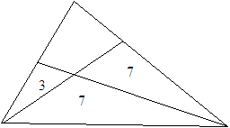

## Zadania matematyczno-logiczne

Zadanie 1:

If a hen and a half during the one and a half day lay one and a half egg, how many eggs will lay 9 hens within 9 days?

Zadanie 2:

What is the next number in the numerical

246,56,61,37,58,89,145,42,?

Zadanie 3:

What is the area around the triangle, where the fields are so much a part thereof, as indicated in the figure?

