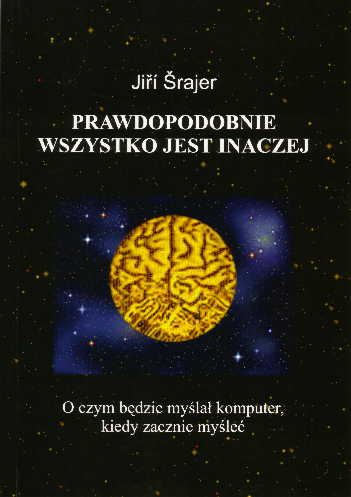

## Probably everything is different

The book was published only in Polish [https://www.mybook.pl/6/0/bid/303](https://www.mybook.pl/6/0/bid/303)

## Probably everything is different
### Table of contents

[Introduction](wprowadzenie)

[I. Can a computer think?](rozdzial1)

[II. Defining concepts](rozdzial2)

[III. What is information?](https://www.mybook.pl/6/0/bid/303)

[IV. Modeling reality](https://www.mybook.pl/6/0/bid/303)

[V. Intellectual capabilities of modern computers](https://www.mybook.pl/6/0/bid/303)

[VI. A few comments on evolution](https://www.mybook.pl/6/0/bid/303)

[VII.Why do we think any laws of nature apply?](https://www.mybook.pl/6/0/bid/303)

[VIII. Considerations on the geometry of the Universe](https://www.mybook.pl/6/0/bid/303)

[IX. What we consider possible and what we consider impossible](https://www.mybook.pl/6/0/bid/303)

[X. Why do we think that we think logically?](https://www.mybook.pl/6/0/bid/303)

[XI. Where do new ideas come from?](https://www.mybook.pl/6/0/bid/303)

[XII.Faith, free will and morality of people and computers](https://www.mybook.pl/6/0/bid/303)

[XIII. Future computer capabilities](https://www.mybook.pl/6/0/bid/303)

[XIV. Conclusion](https://www.mybook.pl/6/0/bid/303)

[APPENDIX A Examples of cellular automata](https://www.mybook.pl/6/0/bid/303)

[APPENDIX B A program in PHP for testing cellular automata](https://www.mybook.pl/6/0/bid/303)

[APPENDIX C Different space-time models](https://www.mybook.pl/6/0/bid/303)

[APPENDIX D A few tasks for the inquisitive](https://www.mybook.pl/6/0/bid/303)

[Literature](literatura)
